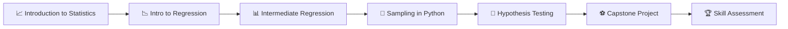

<div align="center">

  
  
  
  
  

  <br>

  <h1>📊 Statistics Fundamentals with Python</h1>
  <p><strong>My learning journey through DataCamp's Statistics Fundamentals skill track — with notes, code snippets, and progress tracking.</strong></p>

  <a href="https://app.datacamp.com/learn/skill-tracks/statistics-fundamentals-with-python">
    
  </a>
  <a href="#progress">
    
  </a>

</div>

---

## 🗺️ Learning Path



---

## 📈 Overall Progress

| Metric | Status |
|--------|--------|
| **Courses Completed** | 0 / 5 |
| **Project Completed** | ❌ |
| **Skill Assessment** | ❌ |
| **Total Hours** | 0 / 20 hrs |
| **Certificate** | ⏳ Pending |

```
████████████████░░░░░░░░░░░░░░░░░░░░  0%
```

---

## 📚 Course Syllabus

Click on any course below to expand details, topics, and my notes.

---

<details>
<summary>
  <b>Course 1: Introduction to Statistics in Python</b> 
  
  
  
</summary>

### 🎯 What You'll Learn
- Apply probability concepts and sampling principles to real-world problems
- Examine relationships between variables using correlation and experimental design
- Interpret and apply the normal distribution and the central limit theorem
- Summarize data using appropriate measures of center and spread
- Use discrete and continuous probability distributions to model real situations

### 📖 Chapters

| # | Chapter | Topics | Status |
|---|---------|--------|--------|
| 1 | **Summary Statistics** | Mean, median, mode, variance, standard deviation, IQR | ⬜ |
| 2 | **Random Numbers & Probability** | Random sampling, probability rules, binomial distribution | ⬜ |
| 3 | **More Distributions & CLT** | Normal distribution, Poisson, exponential, t-distribution, Central Limit Theorem | ⬜ |
| 4 | **Correlation & Experimental Design** | Scatterplots, correlation coefficient, confounding variables, study design | ⬜ |

### 📝 My Notes
> *Add your notes, key takeaways, and code snippets here...*

```python
# Example: Calculating summary statistics
import numpy as np
import pandas as pd

# Your code here
```

**🔗 [Start Course on DataCamp](https://www.datacamp.com/courses/introduction-to-statistics-in-python)**

</details>

---

<details>
<summary>
  <b>Course 2: Introduction to Regression with statsmodels</b> 
  
  
  
</summary>

### 🎯 What You'll Learn
- Assess the accuracy and limitations of model predictions
- Define roles of coefficients, residuals, R-squared, residual standard error
- Differentiate between probability, odds ratio, log-odds in logistic regression
- Evaluate model fit using numerical metrics and diagnostic plots
- Identify appropriate scenarios for linear and logistic regression

### 📖 Chapters

| # | Chapter | Topics | Status |
|---|---------|--------|--------|
| 1 | **Simple Linear Regression** | Fitting models, interpreting coefficients | ⬜ |
| 2 | **Predictions & Model Objects** | Making predictions, model objects in statsmodels | ⬜ |
| 3 | **Assessing Model Fit** | R-squared, residuals, diagnostic plots | ⬜ |
| 4 | **Simple Logistic Regression** | Binary outcomes, odds ratios, confusion matrices | ⬜ |

### 📝 My Notes
> *Add your notes, key takeaways, and code snippets here...*

```python
# Example: Simple linear regression with statsmodels
import statsmodels.api as sm

# Your code here
```

**🔗 [Start Course on DataCamp](https://www.datacamp.com/courses/introduction-to-regression-with-statsmodels-in-python)**

</details>

---

<details>
<summary>
  <b>Course 3: Intermediate Regression with statsmodels</b> 
  
  
  
</summary>

### 🎯 What You'll Learn
- Perform linear and logistic regression with multiple explanatory variables
- Understand parallel slopes and interaction effects
- Explore Simpson's Paradox
- Implement your own linear and logistic regression algorithms

### 📖 Chapters

| # | Chapter | Topics | Status |
|---|---------|--------|--------|
| 1 | **Parallel Slopes** | Multiple explanatory variables, parallel slopes model | ⬜ |
| 2 | **Interactions** | Interaction effects, Simpson's Paradox | ⬜ |
| 3 | **Multiple Linear Regression** | MLR implementation, algorithm from scratch | ⬜ |
| 4 | **Multiple Logistic Regression** | Extending logistic regression, custom implementation | ⬜ |

### 📝 My Notes
> *Add your notes, key takeaways, and code snippets here...*

```python
# Example: Multiple linear regression
import statsmodels.formula.api as smf

# Your code here
```

**🔗 [Start Course on DataCamp](https://www.datacamp.com/courses/intermediate-regression-with-statsmodels-in-python)**

</details>

---

<details>
<summary>
  <b>Course 4: Sampling in Python</b> 
  
  
  
</summary>

### 🎯 What You'll Learn
- Draw conclusions from limited data using sampling techniques
- Perform simple random, systematic, stratified, and cluster sampling
- Estimate population statistics and quantify uncertainty
- Generate sampling distributions and bootstrap distributions

### 📖 Chapters

| # | Chapter | Topics | Status |
|---|---------|--------|--------|
| 1 | **Introduction to Sampling** | When to sample, sampling vs. census | ⬜ |
| 2 | **Sampling Methods** | Simple random, systematic, stratified, cluster sampling | ⬜ |
| 3 | **Sampling Distributions** | Estimating statistics, quantifying uncertainty | ⬜ |
| 4 | **Bootstrap Distributions** | Resampling, bootstrap confidence intervals | ⬜ |

### 📝 My Notes
> *Add your notes, key takeaways, and code snippets here...*

```python
# Example: Bootstrap sampling
import numpy as np

# Your code here
```

**🔗 [Start Course on DataCamp](https://www.datacamp.com/courses/sampling-in-python)**

</details>

---

<details>
<summary>
  <b>Course 5: Hypothesis Testing in Python</b> 
  
  
  
</summary>

### 🎯 What You'll Learn
- Differentiate between Type I and Type II errors
- Distinguish between parametric and non-parametric approaches
- Evaluate p-values, confidence intervals, and test statistics
- Identify suitable hypothesis tests (z-test, t-test, ANOVA, chi-square, non-parametric)
- Recognize correct null and alternative hypotheses

### 📖 Chapters

| # | Chapter | Topics | Status |
|---|---------|--------|--------|
| 1 | **Hypothesis Testing Fundamentals** | Null/alternative hypotheses, z-scores, p-values, Type I/II errors | ⬜ |
| 2 | **Two-Sample & ANOVA Tests** | t-tests, paired t-tests, ANOVA, post-hoc tests | ⬜ |
| 3 | **Proportion Tests** | One-sample and two-sample proportion tests, chi-square tests | ⬜ |
| 4 | **Non-Parametric Tests** | Wilcoxon, Kruskal-Wallis, assumptions checking | ⬜ |

### 📝 My Notes
> *Add your notes, key takeaways, and code snippets here...*

```python
# Example: t-test with pingouin
import pingouin as pg

# Your code here
```

**🔗 [Start Course on DataCamp](https://www.datacamp.com/courses/hypothesis-testing-in-python)**

</details>

---

<details>
<summary>
  <b>⚽ Capstone Project: Hypothesis Testing with Soccer Matches</b> 
  
  
</summary>

### 🎯 Objective
Perform a hypothesis test to determine if more goals are scored in women's soccer matches than men's!

### 📝 My Approach
> *Document your hypothesis, methodology, and findings here...*

```python
# Your project code here
```

**🔗 [Start Project on DataCamp](https://app.datacamp.com/learn/projects/---)**

</details>

---

<details>
<summary>
  <b>🏆 Skill Assessment: Statistics Fundamentals</b> 
  
  
</summary>

### 🎯 Test Your Knowledge
Comprehensive assessment covering all 5 courses in the track.

### 📝 Results
> *Add your score and areas for improvement here...*

| Attempt | Score | Date |
|---------|-------|------|
| 1 | — | — |

</details>

---

## 🛠️ Tech Stack

<div align="center">

| Library | Purpose | Badge |
|---------|---------|-------|
| **pandas** | Data manipulation |  |
| **NumPy** | Numerical computing |  |
| **statsmodels** | Statistical modeling |  |
| **scipy** | Scientific computing |  |
| **pingouin** | Statistical tests |  |
| **matplotlib** | Visualization |  |
| **seaborn** | Statistical visualization |  |

</div>

---

## 📂 Repository Structure

```
stat-py/
├── 📁 course-01-intro-to-statistics/
│   ├── chapter-01-summary-statistics/
│   ├── chapter-02-random-numbers-probability/
│   ├── chapter-03-distributions-clt/
│   └── chapter-04-correlation-experimental-design/
│
├── 📁 course-02-intro-regression/
│   ├── chapter-01-simple-linear-regression/
│   ├── chapter-02-predictions-model-objects/
│   ├── chapter-03-assessing-model-fit/
│   └── chapter-04-simple-logistic-regression/
│
├── 📁 course-03-intermediate-regression/
│   ├── chapter-01-parallel-slopes/
│   ├── chapter-02-interactions/
│   ├── chapter-03-multiple-linear-regression/
│   └── chapter-04-multiple-logistic-regression/
│
├── 📁 course-04-sampling/
│   ├── chapter-01-intro-to-sampling/
│   ├── chapter-02-sampling-methods/
│   ├── chapter-03-sampling-distributions/
│   └── chapter-04-bootstrap-distributions/
│
├── 📁 course-05-hypothesis-testing/
│   ├── chapter-01-hypothesis-testing-fundamentals/
│   ├── chapter-02-two-sample-anova/
│   ├── chapter-03-proportion-tests/
│   └── chapter-04-non-parametric-tests/
│
├── 📁 project-soccer-matches/
│   └── hypothesis-testing-soccer.ipynb
│
├── 📁 datasets/
│   └── (shared datasets across courses)
│
├── 📁 cheatsheets/
│   └── statistics-cheatsheet.md
│
├── README.md          ← You are here
├── LICENSE
└── requirements.txt
```

---

## 🚀 Quick Start

```bash
# Clone the repository
git clone https://github.com/aashutoish/stat-py.git
cd stat-py

# Create virtual environment
python -m venv venv
source venv/bin/activate  # On Windows: venv\Scripts\activate

# Install dependencies
pip install -r requirements.txt

# Start Jupyter to explore notebooks
jupyter notebook
```

### 📋 requirements.txt

```
pandas>=1.5.0
numpy>=1.21.0
matplotlib>=3.5.0
seaborn>=0.12.0
statsmodels>=0.13.0
scipy>=1.9.0
pingouin>=0.5.0
jupyter>=1.0.0
```

---

## 🎯 Key Concepts Covered

<div align="center">

| Concept | Description | Course |
|---------|-------------|--------|
| 📊 **Summary Statistics** | Mean, median, std, IQR, percentiles | 1 |
| 🎲 **Probability** | Rules, distributions, random variables | 1 |
| 📈 **Normal Distribution** | CLT, z-scores, standardization | 1 |
| 🔗 **Correlation** | Pearson r, scatterplots, confounders | 1 |
| 📉 **Linear Regression** | OLS, coefficients, R², residuals | 2 |
| 🔮 **Logistic Regression** | Odds, log-odds, classification | 2, 3 |
| 🏔️ **Parallel Slopes** | Multiple predictors, interactions | 3 |
| 🎲 **Sampling Methods** | SRS, stratified, cluster, systematic | 4 |
| 🔄 **Bootstrap** | Resampling, confidence intervals | 4 |
| 🧪 **Hypothesis Testing** | H₀/H₁, p-values, Type I/II errors | 5 |
| 📊 **t-tests & ANOVA** | One/two-sample, paired, post-hoc | 5 |
| 📋 **Chi-Square** | Goodness-of-fit, independence | 5 |
| 🔍 **Non-Parametric** | Wilcoxon, Kruskal-Wallis | 5 |

</div>

---

## 📖 Study Tips

> 💡 **Tip 1:** Complete the exercises in each chapter before moving on — they build on each other.
>
> 💡 **Tip 2:** Keep a "mistake log" — note which concepts trip you up and revisit them.
>
> 💡 **Tip 3:** Try to explain each concept in your own words in the notes sections.
>
> 💡 **Tip 4:** Use the datasets from earlier courses to practice skills from later courses.
>
> 💡 **Tip 5:** Before the skill assessment, review all your notes and re-do exercises you found difficult.

---

## 🏅 Certificate

> *Once you complete the track, add your DataCamp Statement of Accomplishment here!*

<div align="center">
  
  <br><br>
  <i>Certificate link will be added here upon completion...</i>
</div>

---

## 🤝 Contributing

This is a personal learning repository, but if you spot errors or have suggestions:

1. Fork the repo
2. Create a branch (`git checkout -b fix/typo`)
3. Commit changes (`git commit -am 'Fix typo in notes'`)
4. Push (`git push origin fix/typo`)
5. Open a Pull Request

---

## 📬 Connect

<div align="center">

[](https://github.com/aashutoish)
[](https://www.datacamp.com/profile/your-profile)

</div>

---

<div align="center">
  <p><i>Built with 📊 statistics, 🐍 Python, and ☕ lots of coffee.</i></p>
  <p><sub>Last updated: August 2026</sub></p>
</div>
